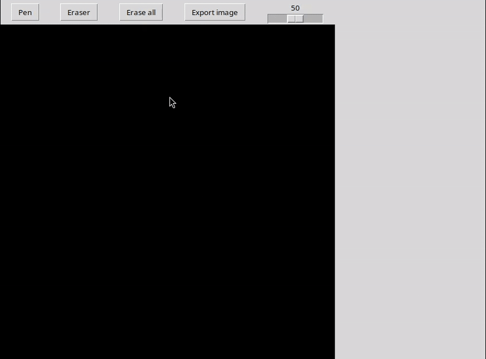

# Salut, je suis Maxime Pires 👋

### Ingénieur IA | CentraleSupélec | Passionné par les fondations du Deep Learning

Je suis un ingénieur en Intelligence Artificielle spécialisé dans le **Deep Learning** et l'**Ingénierie Logicielle**. Mon approche est simple : pour maîtriser des outils complexes comme PyTorch ou TensorFlow, il faut d'abord comprendre ce qui se passe sous le capot.

Je construis des systèmes robustes en alliant mathématiques avancées et optimisation de performance.

---

## 🚀 Projet Phare : MPNeuralNetwork

> *Pourquoi utiliser une boîte noire quand on peut construire le moteur ?*

J'ai développé un framework de Deep Learning complet **from scratch** en utilisant uniquement **NumPy**. Ce n'est pas juste un projet éducatif, c'est une librairie optimisée pour la performance.

* **⚡ Performance :** Vectorisation complète et implémentation de `im2col` pour les convolutions (400% de gain de vitesse vs boucles naïves).
* **🛠 Ingénierie :** Pipeline CI/CD, Typage statique (MyPy), Linting (Ruff) et Tests unitaires.
* **🧠 Fonctionnalités :** Conv2D, AdamW, Dropout, Early Stopping, et sérialisation de modèles.

[**Voir le Code**](https://github.com/maximepires4/mp-neural-network) | [**Voir la Démo MNIST**](https://github.com/maximepires4/handwriting-recognition)

---

## 🤖 Assistant IA : MPNN RAG

> *Un assistant intelligent pour explorer ma librairie.*

Pour faciliter l'adoption de **MPNeuralNetwork**, j'ai créé un agent **RAG (Retrieval-Augmented Generation)** capable de répondre aux questions techniques sur la documentation et le code.

* **🔍 Architecture RAG :** Recherche Hybride (BM25 + ChromaDB) et Re-ranking (Cross-Encoder).
* **🧠 Multi-LLM :** Support de Google Gemini, OpenAI et Ollama (Llama 3).
* **💻 Interfaces :** Chat interactif via CLI ou Web (Streamlit).

[**Voir le Projet**](https://github.com/maximepires4/mpnn-rag)

---

## 🛠 Stack Technique

**Deep Learning & Data Science**

**Engineering & DevOps**

**Web & App**

---

## 📊 En bref

* 📄 **CV / Resume :** [🇫🇷 Français](./CV_Maxime_Pires_Ingenieur_IA.pdf) | [🇬🇧 English](./Resume_Maxime_Pires_AI_Engineer.pdf)
* 🎓 **Formation :** Diplômé de **CentraleSupélec** (Ingénierie IA) & **ECE** Paris.
* 🔭 **Actuellement :** Je travaille sur l'optimisation bas niveau de réseaux de neurones.
* 📫 **Me contacter :** [LinkedIn](https://www.linkedin.com/in/maximepires) | [Email](mailto:maximepires4@gmail.com)

---

